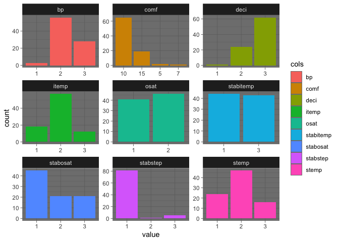

Post Operative Patient Admission ML Support Vector Machines
================
Rex Manglicmot

-   <a href="#status-continuing-working-document"
    id="toc-status-continuing-working-document">Status: Continuing Working
    Document</a>
-   <a href="#introduction" id="toc-introduction">Introduction</a>
-   <a href="#loading-the-libraries" id="toc-loading-the-libraries">Loading
    the Libraries</a>
-   <a href="#loading-the-data" id="toc-loading-the-data">Loading the
    Data</a>
-   <a href="#cleaning-the-data" id="toc-cleaning-the-data">Cleaning the
    Data</a>
-   <a href="#exploratory-data-analysis"
    id="toc-exploratory-data-analysis">Exploratory Data Analysis</a>
-   <a href="#support-vector-machines"
    id="toc-support-vector-machines">Support Vector Machines</a>
-   <a href="#limitations" id="toc-limitations">Limitations</a>
-   <a href="#conclusions" id="toc-conclusions">Conclusions</a>
-   <a href="#inspiration-for-this-project"
    id="toc-inspiration-for-this-project">Inspiration for this project</a>
-   <a href="#appendix-code" id="toc-appendix-code">Appendix Code</a>

## Status: Continuing Working Document

Hi everyone. I’m continuing building my data analysis and R skills. As
such, I would love feedback to better improve this project via
<rexmanglicmot@gmail.com>. Any mistakes and misrepresentation of the
data are my own.

Things Need to Do/Questions:

-   **find ‘?’ FIRST BEFORE changing columns to factors, otherwise it
    will change the ? into 1.** (major self-inflicted headache)
-   Why is the “A” still there?
-   Need to take out the “?” in the dataset
-   Concept on SVM
-   Work on intro + cite sources

## Introduction


**“You can ask and advocate for a lot of things here, just don’t ask for
space.”** – CEO, “Hawaii” Hospital

The quote above represents a memory during my time working in at
influential and central hospital on the Hawaiian islands. Space has
always been an issue and as such, the number of patients healthcare
providers can provide is limited to space within the hospitals. Many
Hospitals have criteria of when to admit a patient after the ER and OR.
While Hispitals go through this process, sometimes, patients may have to
wait for a bed to clear or get squeezed into another patient room,
obstructing the healing journey. One way we can help alleviate the bed
issue is by predicting when a patient will likely need a roo after
surgery whether if elected or not. It is only near the final stages of
surgery, when discussions are amde whether to admist a patient.
Therefore, this decision by the hospital is subjective based on the
capacity of the hosptial staff, supplies, nursing staff, etc. There
needs to be a more objective and quantitative rubric for admitting
patients into the hospital , especially after surgery.

The objective for this project is as follows:

1)  Help clinicians decide if a patient will be admitted after surgery
2)  Provide numerical data such that Hospital C-Suites can plan and
    optimize hospital operations to maintain and improve patient
    hospital experiences.

A special acknowledgement to the University of Irvine’s Data Repository
for hosting a wide range of datasets students could use.[^1] A special
acknowledgement to Budihardjo et al.[^2] and Woolery et al.[^3] for
providing the data therein their papers.

The attributes are as follows:

1.  L-CORE (patient’s internal temperature in C): high (\> 37), mid (\>=
    36 and \<= 37), low (\< 36)
2.  L-SURF (patient’s surface temperature in C): high (\> 36.5), mid
    (\>= 36.5 and \<= 35), low (\< 35)
3.  L-O2 (oxygen saturation in %): excellent (\>= 98), good (\>= 90 and
    \< 98), fair (\>= 80 and \< 90), poor (\< 80)
4.  L-BP (last measurement of blood pressure): high (\> 130/90), mid
    (\<= 130/90 and \>= 90/70), low (\< 90/70)
5.  SURF-STBL (stability of patient’s surface temperature): stable,
    mod-stable, unstable
6.  CORE-STBL (stability of patient’s core temperature) stable,
    mod-stable, unstable
7.  BP-STBL (stability of patient’s blood pressure) stable, mod-stable,
    unstable
8.  COMFORT (patient’s perceived comfort at discharge, measured as an
    integer between 0 and 20)
9.  decision ADM-DECS (discharge decision): I (patient sent to Intensive
    Care Unit), S (patient prepared to go home), A (patient sent to
    general hospital floor)

## Loading the Libraries

``` r
library(tidyverse)
library(plyr)
library(ggplot2)
```

## Loading the Data

``` r
#create object to load files from the web
url <- 'https://archive.ics.uci.edu/ml/machine-learning-databases/postoperative-patient-data/post-operative.data'

#load the data
data_orig <- read.csv(url, header=TRUE)
```

## Cleaning the Data

**OH BOY**, we got some cleaning to do!

``` r
#view the first few rows of the data
head(data_orig)
```

    ##    mid  low excellent mid.1 stable stable.1   stable.2 X15  A
    ## 1  mid high excellent  high stable   stable     stable  10  S
    ## 2 high  low excellent  high stable   stable mod-stable  10  A
    ## 3  mid  low      good  high stable unstable mod-stable  15 A 
    ## 4  mid  mid excellent  high stable   stable     stable  10  A
    ## 5 high  low      good   mid stable   stable   unstable  15  S
    ## 6  mid  low excellent  high stable   stable mod-stable  05  S

``` r
dim(data_orig)
```

    ## [1] 89  9

Calling the dim function, we have 89 rows and 9 columns. According to
the UCI website, there should be 90 rows. It would seem that the column
names are actually an observation and adding that back to the dataframe
would make the dataset whole. Let’s create a new row.

Also, because the original column names are missing from the dataset, we
would have to assume that the column names go in the order in which it
was presented on the UCI website. As such, I will rename the columns
accordingly.

``` r
#make a copy
data <- data_orig

#add another row the the dataset filled with values from the column
#row will added to the bottom of the dataset
data[nrow(data) +1,] <- c('mid', 'low', 'excellent', 'mid', 'stable', 'stable', 'stable', '15', 'A')

#check the last row
tail(data, 1)
```

    ##    mid low excellent mid.1 stable stable.1 stable.2 X15 A
    ## 90 mid low excellent   mid stable   stable   stable  15 A

``` r
#change column names and make them shorter
colnames(data) <- c('itemp', 'stemp', 'osat', 'bp', 'stabitemp', 'stabstep', 'stabosat', 'comf', 'deci')

#check if it worked
names(data)
```

    ## [1] "itemp"     "stemp"     "osat"      "bp"        "stabitemp" "stabstep" 
    ## [7] "stabosat"  "comf"      "deci"

``` r
#check for ?
any(data =='?')
```

    ## [1] TRUE

``` r
#send location!
which(data == '?', arr.ind=TRUE)
```

    ##    row col
    ## 46  46   8
    ## 48  48   8
    ## 70  70   8

``` r
#let's delete those observations with ? as we want our data to be tidy
data <- data[-c(46, 48, 70),]

#Check for ?
any(data =='?')
```

    ## [1] FALSE

``` r
#row and column of said value
any(data =='A ')
```

    ## [1] TRUE

``` r
#let's remove the "A "
which(data == 'A ', arr.ind=TRUE)
```

    ##   row col
    ## 3   3   9

``` r
#change value
#change to a 3
data[3, 9] = "A"

#check observation [3,9]
data$deci[[3]]
```

    ## [1] "A"

Good. Now, let’s check all the unique values

``` r
#find the uniques values in each column
uni <- lapply(data, unique)

uni
```

    ## $itemp
    ## [1] "mid"  "high" "low" 
    ## 
    ## $stemp
    ## [1] "high" "low"  "mid" 
    ## 
    ## $osat
    ## [1] "excellent" "good"     
    ## 
    ## $bp
    ## [1] "high" "mid"  "low" 
    ## 
    ## $stabitemp
    ## [1] "stable"   "unstable"
    ## 
    ## $stabstep
    ## [1] "stable"     "unstable"   "mod-stable"
    ## 
    ## $stabosat
    ## [1] "stable"     "mod-stable" "unstable"  
    ## 
    ## $comf
    ## [1] "10" "15" "05" "07"
    ## 
    ## $deci
    ## [1] "S" "A" "I"

Looks good!

Let’s look for any NA values

``` r
#check for NAs
sum(is.na(data))
```

    ## [1] 0

``` r
#check for NAs via another way
any(is.na(data))
```

    ## [1] FALSE

``` r
#check for NAs a third way
which(is.na(data))
```

    ## integer(0)

``` r
#check a furth way #need to figure why a "2" is there
apply(is.na(data),2,sum)
```

    ##     itemp     stemp      osat        bp stabitemp  stabstep  stabosat      comf 
    ##         0         0         0         0         0         0         0         0 
    ##      deci 
    ##         0

``` r
#last check with sapply
sapply(data, function(x) sum(is.na(x)))
```

    ##     itemp     stemp      osat        bp stabitemp  stabstep  stabosat      comf 
    ##         0         0         0         0         0         0         0         0 
    ##      deci 
    ##         0

Looks good!

Convert the factors to numbers for modeling. Replace values in each of
the appropriate columns.

``` r
#convert itemp column
revalue(data$itemp, c('low' = 1, 
                      'mid' = 2,
                      'high' = 3)) -> data$itemp

#convert stemp column
revalue(data$stemp, c('low' = 1, 
                      'mid' = 2,
                      'high' = 3)) -> data$stemp

#convert stemp osat
revalue(data$osat, c('excellent' = 1, 
                      'good' = 2,
                      'fair' = 3,
                     'poor' = 4)) -> data$osat

#convert bp column
revalue(data$bp, c('low' = 1, 
                  'mid' = 2,
                  'high' = 3)) -> data$bp

#convert stabitemp
revalue(data$stabitemp, c('stable' = 1, 
                  'mod-stable' = 2,
                  'unstable' = 3)) -> data$stabitemp

#convert stabstep
revalue(data$stabstep, c('stable' = 1, 
                  'mod-stable' = 2,
                  'unstable' = 3)) -> data$stabstep

#convert stabosat
revalue(data$stabosat, c('stable' = 1, 
                  'mod-stable' = 2,
                  'unstable' = 3)) -> data$stabosat

#convert deci
revalue(data$deci, c('I' = 1, 
                  'S' = 2,
                  'A' = 3)) -> data$deci
```

Need to covert into factors except comf which is an integer

``` r
#convert all columns into a factor
data <- data.frame(lapply(data, factor))

#convert comf into a integer
data$comf <- as.numeric(as.character(data$comf))

#let's check
sapply(data, class)
```

    ##     itemp     stemp      osat        bp stabitemp  stabstep  stabosat      comf 
    ##  "factor"  "factor"  "factor"  "factor"  "factor"  "factor"  "factor" "numeric" 
    ##      deci 
    ##  "factor"

One final check

``` r
#final check
summary(data)
```

    ##  itemp  stemp  osat   bp     stabitemp stabstep stabosat      comf       deci  
    ##  1:18   1:24   1:41   1: 3   1:44      1:81     1:45     Min.   : 5.00   1: 1  
    ##  2:57   2:47   2:46   2:56   3:43      2: 1     2:21     1st Qu.:10.00   2:24  
    ##  3:12   3:16          3:28             3: 5     3:21     Median :10.00   3:62  
    ##                                                          Mean   :10.94         
    ##                                                          3rd Qu.:10.00         
    ##                                                          Max.   :15.00

Looks good. Now off to the best part, exploring the data!

## Exploratory Data Analysis

Because we are dealing with ordinal data the best way to visualize this
is through a bar plot. To make the code simple, I decided to graph each
variable against the number of distinct values therein.

``` r
#create barcharts for all variables using fewest lines of code possible. 
ggplot(gather(data, cols, value), aes(x = value, fill=cols)) + 
  geom_bar() + 
  facet_wrap(.~cols, scales = 'free') + 
  theme_dark()
```

    ## Warning: attributes are not identical across measure variables;
    ## they will be dropped

<!-- -->

Insights:

-   The dependent variable, there seems to be more of the category 3
    than 2 and 1.
-   osat and stableitemp has equal distribution of data.
-   comf and stabstep is more left skewed
-   itemp and stemp looks like a normal distribution

Now, let’s learn about SVMS theory.

## Support Vector Machines

SVMs are used for two-group classifications. SVM does this by
calculating which line is best fitted to the data. In laymen terms, it
finds the best fit line of separation called the ’hyperplane.” This
hyperplane helps segregate the two categories. Points that are
distinguish far from the hyperplane can be easily classified whereas
other points that are not are difficult. This is because these data
points are close to the hyperplane and are called “support vectors.” The
Maximum Margin (MM)refers to the maximum width of the support vectors.
The MM is parallel to the hyplerplane.

SVM maximizes the margin surrounding the hyperplane (the “streets”).
This is determine by the training data set and of course applied to the
test data set.

Applications of vary from facial classification, text and handwriting
classification, speech, cancer amongst many more.


Advantages of SVM:

-   Useful for high dimensional spaces
-   Useful for datasets where the number of dimensions \> number of
    observations
-   High speed and better performance if limited observations
    (thousands)
-   Useful for text classifications
-   Small datasets

Disadvantages of SVM:

-   Do not provide probability estimate
-   Not useful for large datasets
-   Computationally expensive
-   Limitation to two-classifications
-   Lack of probabilistic interpretation
-   Not useful for datasets with missing values

In this project, we will use SVM to predict if a patient will be
admitted into the hospital following surgery.

## Limitations

## Conclusions

## Inspiration for this project

## Appendix Code

``` r
# #where is the "?"
# 
# #check observation [3,9]
# data$deci[[3]]
# 
# #change to a 3
# data[3, 9] = 3
# 
# #another way to check [3,9] observation
# print(3,9)
```

\`\`\`

[^1]: <https://archive.ics.uci.edu/ml/index.php>

[^2]: A. Budihardjo, J. Grzymala-Busse, L. Woolery (1991). Program
    LERS_LB 2.5 as a tool for knowledge acquisition in nursing,
    Proceedings of the 4th Int. Conference on Industrial & Engineering
    Applications of AI & Expert Systems, pp. 735-740.

[^3]: L. Woolery, J. Grzymala-Busse, S. Summers, A. Budihardjo (1991).
    The use of machine learning program LERS_LB 2.5 in knowledge
    acquisition for expert system development in nursing. Computers in
    Nursing 9, pp. 227-234.
